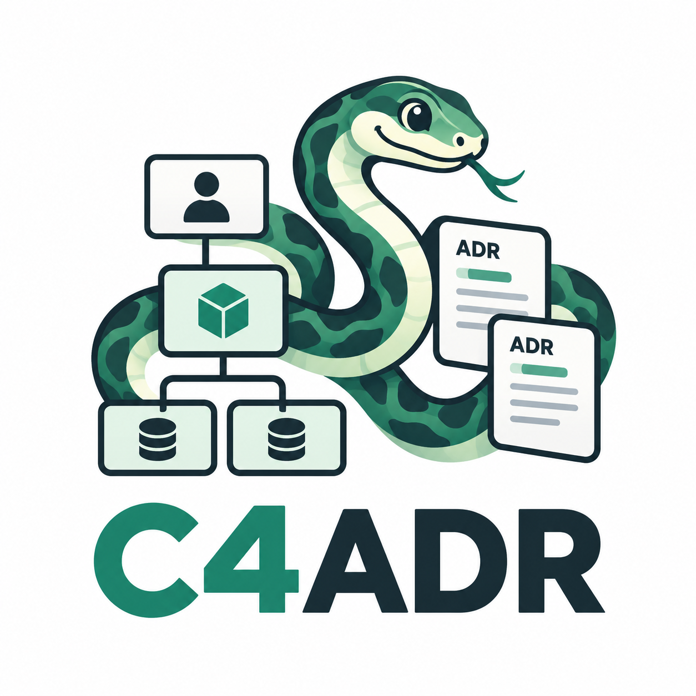

# ADR Diagram


C4ADR (Pronouced Ceeee-Adder, bad pun in know) is a browser-based editor for structured software architecture diagrams. Components,
relationships, ADR links, and system groups have stable UUIDs, changes can be explicitly saved
through the REST API, and validated diagrams can be downloaded as Mermaid files.

## Developed features

- Create and name architecture diagrams in a browser-based editor.
- Add, move, and remove software architecture components with stable UUIDs.
- Create C4 System Context components as Person or Software System artifacts, while keeping older
  unclassified components readable.
- Create/reopen one C4 container diagram per Software System and model Application/Datastore
  containers with source-linked external participants.
- Connect components with labeled directed or undirected relationships.
- Group two or more Software Systems inside a labeled, movable boundary without rearranging their
  existing positions.
- Review, rename, remove membership from, or confirm ungrouping of a system group while preserving
  component, relationship, and ADR identities.
- Browse saved diagrams and load a selected diagram back into the editor.
- Preserve diagram names, C4 types, component positions, group membership/layout, relationship
  endpoints, labels, and metadata in PostgreSQL.
- Show clear saved, unsaved, saving, and failed-save states.
- Undo and redo diagram edits during the active editing session.
- Check component dependencies before deletion and prevent removal when relationships still exist.
- Move diagrams to recoverable trash and restore them later.
- Export validated diagrams as downloadable Mermaid files.
- Escape supported Mermaid-reserved characters and report actionable export validation errors.
- Provide keyboard-accessible controls, readable labels, and accessible status feedback.

## Setup

Prerequisites: Node.js (current LTS), npm, and PostgreSQL when using the database deployment.

```text
npm install
npm run build
npm run dev
```

The frontend is available at `http://localhost:5173`; the Fastify API runs at
`http://localhost:3000`. Set `DATABASE_URL` in the environment of the API process for a PostgreSQL
deployment; the current server does not automatically load `backend/.env`. Apply additive migrations
in order with your PostgreSQL migration runner before deploying the corresponding runtime:

```text
psql "$DATABASE_URL" -f backend/drizzle/0001_initial.sql
psql "$DATABASE_URL" -f backend/drizzle/0002_adrs.sql
psql "$DATABASE_URL" -f backend/drizzle/0003_system_groups.sql
psql "$DATABASE_URL" -f backend/drizzle/0004_component_dimensions.sql
psql "$DATABASE_URL" -f backend/drizzle/0005_c4_container_diagrams.sql
psql "$DATABASE_URL" -f backend/drizzle/0006_container_component_types.sql
```

Migration `0003_system_groups.sql` adds `system_groups` and normalized
`system_group_members` rows. It does not cascade group deletion into components, relationships, or
ADR links.

Preserve an already-applied `0005_c4_container_diagrams.sql` and apply only pending migrations.
Migration 0006 adds `container_type` and backfills **Application only for existing internal
containers**, including trashed children. General/external elements retain null subtypes and
original types; UUIDs, creation times, metadata, geometry, relationships and ADR links remain
unchanged. It never infers Datastore from metadata. Apply 0006 before deploying runtime validation
that requires subtype; authors can then change existing data stores to Datastore. New internal
writes missing a subtype fail validation.

## Tests

```text
npm test
npm run test:e2e
```

`npm test` runs domain, validation, persistence, API contract, adapter, compatibility, and export
tests. `npm run test:e2e` starts the frontend and API together and runs the browser workflows.
For release validation, configure a dedicated migrated `DATABASE_URL` and set
`RUN_POSTGRES_TESTS=1`; skipped database tests do not establish migration, rollback or race safety.
See the [container quickstart](specs/009-c4-container-diagrams/quickstart.md) and
[validation evidence](specs/009-c4-container-diagrams/validation.md) for commands and outstanding gates.

## Mermaid preview

Create a diagram with at least one component and relationship, choose **Export Mermaid**, and open
the downloaded `.mmd` file in a Mermaid-compatible previewer such as Mermaid Live. Export validates
the complete domain document first; invalid content produces an actionable message and no file.
Person and Software System nodes use distinct Mermaid shapes, and each system group is emitted as a
labeled `subgraph`. Mermaid preserves group meaning and membership, but not exact canvas positions.

## Interactive HTML package

Choose **Export HTML package** to download the active diagram and all of its ADRs as a ZIP. Extract
the ZIP and open `index.html` directly to browse the diagram offline. The package also includes
`adrs.html`, an editable `diagram.svg`, and one UUID-named Markdown file per ADR under `adrs/`.
Its links are relative, so the extracted folder can be moved as a unit. Edit `--component-outline`
and `--component-fill` near the top of `styles.css` to recolor component shapes in the HTML pages.
The exact package paths and navigation contract are documented in
[`package-format.md`](specs/007-export-interactive-html/contracts/package-format.md).

## Command line diagram list and export

Run the CLI from the repository checkout with Node.js dependencies installed. It reads saved data
from the REST API and defaults to `http://localhost:3000`; set `ADR_DIAGRAM_API_URL` to another
absolute HTTP or HTTPS service URL when needed.

```text
npm run cli -- --help
npm run cli -- diagrams list
npm run cli -- diagrams list --name payments
npm run cli -- diagrams list --format json
npm run cli -- diagrams export 00000000-0000-4000-8000-000000000001 --output .\architecture.zip
```

The list shows each diagram's stable UUID, name, and timestamps. Name filtering ignores case, and
JSON output is an array suitable for scripts. Export uses the persisted diagram and its full ADR set
to create the same portable package as the browser exporter. The output path must end in `.zip`,
its parent directory must already exist, and an existing file is never replaced.

Successful commands exit with status `0`. Service, validation, and file errors exit with status `1`;
invalid command syntax exits with status `2`. Diagnostics are written to standard error.

The list table also identifies diagram level, parent and owning Software System. JSON remains a flat
array with `kind` and resolved `scope`. Container exports retain the child's own name, canonical scope,
Application/Datastore subtypes, responsibilities, technologies, protocols and local ADR links.

Component width and height are stored with the diagram and default to 180 by 72 when an older
document is read. Apply `backend/drizzle/0004_component_dimensions.sql` before running against an
existing PostgreSQL database so saved resizes are retained.

## C4 system groups

New components use the C4 System Context vocabulary:

- **Person** represents a user, actor, role, or persona interacting with systems.
- **Software System** represents a system shown in the system-context view and is eligible for
  grouping.

Groups contain at least two Software Systems. A component belongs to at most one non-nested group,
and group names are unique after trimming and ignoring capitalization. Creating a group fits a
labeled boundary around the existing member positions; moving or resizing a member automatically
expands, repositions, or shrinks the boundary without changing membership. Moving the boundary
translates all members by the same delta.

Plain clicks select one component for editing. Hold **Shift** while clicking to build a temporary
grouping selection; incompatible Person/Software System selections are rejected with an explanation
and no partial mutation. Ungrouping and membership removal preserve the stable component,
relationship, and ADR references.

Documents created before C4 types or groups remain readable: omitted groups load as `groups: []`,
and a null component type is shown as **Unclassified** until it is classified.

## C4 container diagrams

Save a general diagram containing a Software System, then double-click the system or select/view it
and activate **Create container diagram**. Both entry points reopen the same canonical child after
creation, including grouped systems or systems with identical names. A Person, group or internal
container cannot own a child. An external Software System action resolves its parent source identity.
Unsaved parent/ADR work uses Save/Discard/Cancel; failed creation/loading leaves current work visible
and offers retry. A trashed child offers restoration and reserves its identity.

Inside a child, **Add component** and editing offer exactly **Application** and **Datastore**.
Name, responsibilities and technology are required; interactions are directed and require a
description, with an optional protocol. Creation forms reset when switching from a parent, so
Person/Software System drafts cannot become internal containers. **Include external participant**
is a separate workflow for parent People and other Software Systems. Source details are read-only
in the child: edit them in the parent, then reopen or use **Refresh source details**. Local occurrence
positions, relationships and ADR links retain UUIDs independently of parent positions.

The boundary fits internal containers; affected externals move outside with clearance in the same
undoable edit. Invalid overlap leaves previous geometry intact. Save and Save-before-navigation
update the existing child's own ID/name/level/scope. Failed or mismatched save responses retain the
draft for retry. **Return to** uses the persisted parent association and guards diagram/ADR work;
entering through the library or another source never changes ownership.

The library nests children beneath parent UUIDs and shows their own name, level, owner and parent.
Name/date filters match each diagram's own fields: contextual parent headings for matching children
do not inflate counts, and a matching parent does not make unrelated children match. Missing parent
summaries retain context; duplicate names do not merge parents.

Owner deletion/reclassification and unsupported source reclassification are blocked while active or
recoverable children depend on them. `DIAGRAM_DEPENDENCY` names each child/status and identifies
source and occurrence UUIDs. Restore a trashed child if necessary, explicitly resolve its local
relationship/ADR blockers and remove the occurrence before changing the parent source. Rejected
writes preserve sources, occurrences, relationships and ADR links. Supported Person/Software System
changes remain available for sources that do not own a child.

Trash confirmations name the parent and currently active affected children. Restoration previews
the canonical root and exact trash batch through `GET /diagrams/{id}/restore-impact`. Confirm that
ID set and batch against the root restore route; changed previews require refresh/reconfirmation.
When initiated from a child whose parent is trashed, confirmation restores the parent batch first.
A child independently trashed earlier stays trashed and needs separate confirmation after the
parent is active. Cancel changes nothing; failures retain work. Successful recovery followed by a
failed refresh/load offers retry without restoring again. See
[OpenAPI 1.2.0](specs/009-c4-container-diagrams/contracts/openapi.yaml).

Populated children export scope/boundary, subtypes, metadata, externals and interactions. Browser HTML
captures the current diagram and ADR draft, then resolves current parent source metadata without
saving; CLI HTML uses persisted data. Empty children retain their boundary in SVG/HTML; Mermaid
returns `422 EMPTY_CONTAINER_MERMAID` with those alternatives and produces no file. Unsupported
content fails explicitly. Parent packages contain one diagram and state that child contents are
not bundled. Extract the ZIP and open `index.html` offline to follow local ADR links.

## Project boundaries

The shared domain model is authoritative. React Flow is only a visual adapter, and Mermaid export
consumes validated domain data. This keeps component UUIDs stable for relationships, ADR component
links, and group membership; renaming or repositioning an artifact never rewrites those references.
